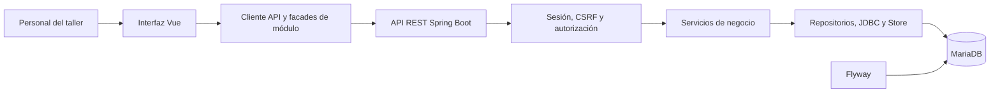

# TallerMeco

**Sistema web para administrar la operación de un taller mecánico.**

La aplicación combina una interfaz Vue con una API Spring Boot y una base de datos MariaDB. Este repositorio contiene el código, las migraciones, scripts de operación y documentación de diseño.

| Área | Tecnología |
|---|---|
| Interfaz | Vue 3 · TypeScript · Vite · Tailwind CSS |
| API y reglas de negocio | Java 21 · Spring Boot · Spring Security |
| Persistencia | MariaDB · Spring JDBC · Flyway |
| Entorno local documentado | NixOS/Linux · Podman |

> **Progreso:** consulta [el estado del proyecto](docs/estado-del-proyecto.md) para ver los entregables, su estado y la evidencia en el código. El estado describe lo implementado en el repositorio; no representa una certificación de producción.

## Avance del proyecto

| Módulo / entregable | Estado | Evidencia y siguiente hito |
|---|---|---|
| Inicio de sesión, sesiones y roles | ✅ Implementado | [Seguridad](backend/src/main/java/mx/tallermeco/config/SecurityConfig.java) · Mantener pruebas de permisos al ampliar flujos. |
| Gestión de clientes | ✅ Implementado | [Módulo de clientes](backend/src/main/java/mx/tallermeco/customer/) · Alta, ficha, edición, validación de duplicados y fotografía. |
| Dirección por código postal | ✅ Implementado | [Autollenado postal](docs/direcciones-codigo-postal.md) · Estado, municipio y selección de colonia; consulta local sin API de pago. |
| Empresa y primer taller | 🟡 Parcial | [API de configuración](backend/src/main/java/mx/tallermeco/customer/WorkshopSetupController.java) · Falta una pantalla administrativa de inicio. |
| Vehículos y órdenes | 🟡 Base funcional | [API del taller](backend/src/main/java/mx/tallermeco/workshop/) · Completar y validar el recorrido hasta la entrega. |
| Inventario, pagos y reportes | 🟡 Base funcional | [Inventario](backend/src/main/java/mx/tallermeco/inventory/) · Validar los recorridos integrales con datos controlados. |
| Pruebas automatizadas | 🟡 Hay suites; no verificadas en esta actualización | [Pruebas disponibles](backend/src/test/) · Ejecutar y registrar resultado antes de la siguiente entrega. |
| Alta desde cero de la base | 🟡 Procedimiento incompleto | [Detalle y pendiente](docs/estado-del-proyecto.md#resumen-de-avance) · Registrar el baseline de Flyway en el proceso inicial. |

Consulta el [reporte detallado de avance](docs/estado-del-proyecto.md) para ver criterios, evidencias enlazadas, próximos pasos y diagramas. **“Implementado” indica que el código existe; no significa que las pruebas se hayan ejecutado en esta actualización.**

## Qué incluye

- Inicio de sesión con sesión de servidor, roles y protección CSRF.
- Registro, consulta, edición y fotografía de clientes.
- Autollenado de direcciones mexicanas por código postal, con catálogo local SEPOMEX.
- Asociación de clientes con talleres y datos de empresa.
- API y vistas para vehículos, órdenes de servicio, inventario y reportes.
- Registro de pagos, movimientos de inventario, auditoría e historial.
- Migraciones de base de datos versionadas y pruebas automatizadas para áreas de autenticación y clientes.

## Arquitectura



El módulo de clientes muestra la separación **vista → facade → API** en el frontend y **controller → service → repository → base de datos** en el backend. Otros módulos conservan acceso JDBC mediante `Store`; la tabla de progreso explica el alcance por área.

## Arranque en el entorno local preparado

Los scripts están preparados para el entorno Linux de Camerabox, que ya cuenta con dependencias locales de Maven y Vue, Podman y configuración privada en `.env`. Se requieren Java 21, Node.js/npm y Podman Compose.

Para iniciar el entorno preparado:

```sh
./scripts/app-start.sh
```

El script inicia MariaDB, compila la interfaz, aplica las migraciones pendientes de Flyway y levanta Spring Boot. Abre [http://127.0.0.1:8080/#/login](http://127.0.0.1:8080/#/login).

Si la base está vacía, la cuenta administrativa se crea cuando `ADMIN_INITIAL_PASSWORD` está configurada y tiene al menos 12 caracteres. El correo inicial es `cameraadmin@tallermeco.local`; la contraseña vive únicamente en `.env`. El primer taller se configura una sola vez desde el endpoint administrativo descrito en el [estado del proyecto](docs/estado-del-proyecto.md).

### Preparar otra instalación

`scripts/db-init.py` crea una base nueva y aplica V1 directamente. El backend tiene `spring.flyway.baseline-on-migrate=false`; por ello, ese inicializador por sí solo no registra una línea base de Flyway. El repositorio todavía no incluye un procedimiento versionado de principio a fin para inicializar una base nueva y registrar su línea base. El [estado del proyecto](docs/estado-del-proyecto.md) marca este trabajo como pendiente para que no se confunda con el arranque del entorno ya preparado.

No ejecutes el inicializador contra una base existente: se detiene si detecta `tallermeco` y las modificaciones posteriores deben pasar por migraciones.

## Operación local

| Acción | Comando |
|---|---|
| Comprobar MariaDB y la respuesta CSRF | `./scripts/db-check.sh` y `curl --fail http://127.0.0.1:8080/api/auth/csrf` |
| Guardar un respaldo SQL | `./scripts/db-backup.sh` |
| Detener la aplicación | `./scripts/app-stop.sh` |
| Detener MariaDB | `./scripts/db-stop.sh` |

La base persistente se guarda en `.local/mariadb`, y los respaldos SQL en `backups/`. Ambos directorios están excluidos de Git. El archivo `.env` también está excluido; nunca publiques credenciales ni respaldos.

## Desarrollo y verificación

Desde la raíz del repositorio:

```sh
npm --prefix frontend ci
npm --prefix frontend run build
node --test tests/auth-frontend.mjs
./scripts/test-auth-backend.sh
```

La prueba backend prepara una base aislada con credenciales locales en `.local/auth-test.env`. La ejecución de esta revisión documental no incluyó pruebas ni compilaciones; consulta el [estado del proyecto](docs/estado-del-proyecto.md) para distinguir los archivos de prueba existentes de una ejecución reciente.

## Datos y reglas importantes

- Las migraciones están en `backend/src/main/resources/db/migration/`. V1 crea el esquema; V2–V5 amplían movimientos, roles, clientes/talleres y perfil.
- Las cantidades de movimientos de inventario tienen signo; los consumos y las devoluciones conservan sus costos y precios históricos.
- Pagos, movimientos de inventario, auditoría e historial son registros históricos protegidos contra cambios directos.
- El sistema no almacena datos de tarjetas.
- El modelo no define aún impuestos, descuentos ni una política de costeo. Véase [modelo de datos](docs/modelo.md).

## Mapa de documentación

- [Índice de documentación](docs/README.md)
- [Estado y progreso](docs/estado-del-proyecto.md)
- [Modelo de datos y reglas](docs/modelo.md)
- [Alcance de Fase 2](docs/FASE%202%20%E2%80%94%20TallerMeco.md)
- [Modelo de clientes y talleres](docs/Astra%20%E2%80%94%20P2-02%20Modelo%20de%20clientes%20y%20talleres.md)
- [Diagramas del sistema](docs/diagrams/)
