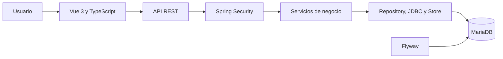
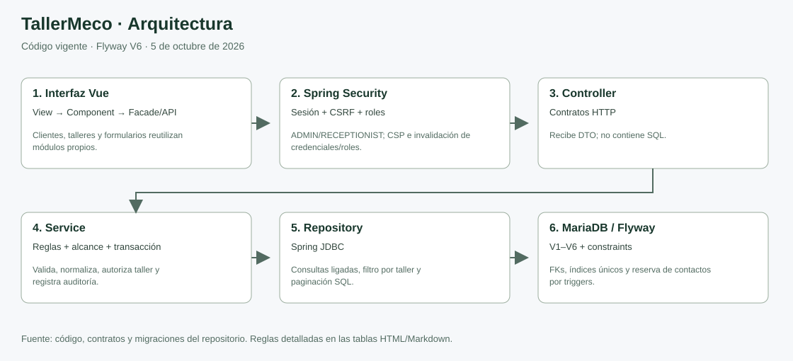
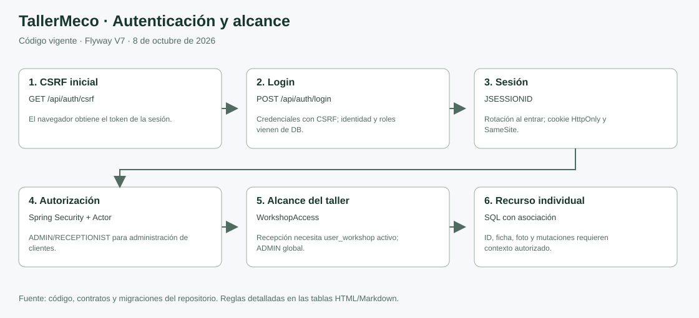
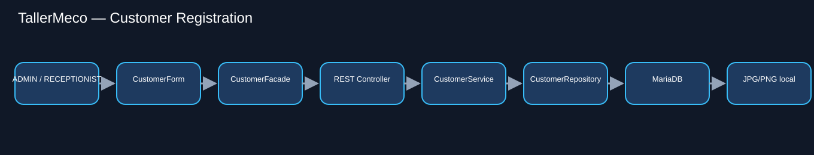
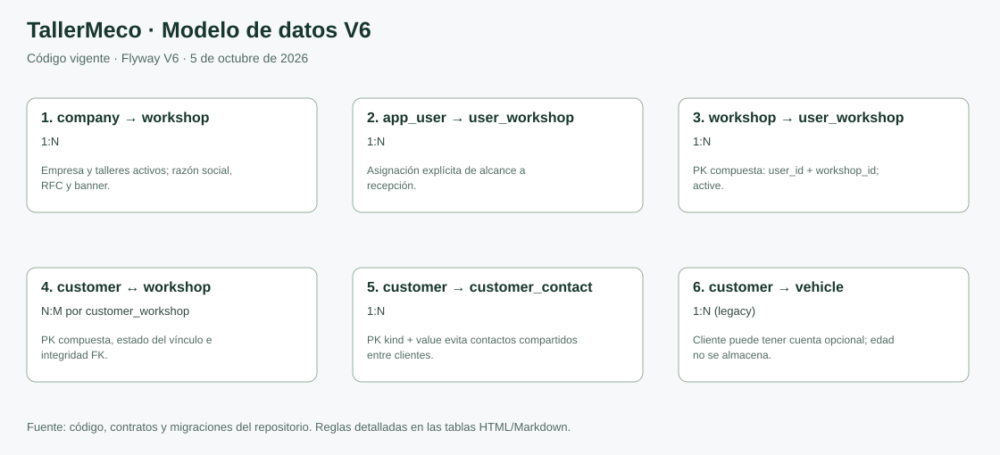

# Estado del proyecto

| Dato | Valor |
|---|---|
| Actualizado | 5 de octubre de 2026 |
| Producto | Aplicación web para administrar un taller mecánico |
| Fuente del reporte | Código, migraciones, scripts y pruebas del repositorio |

Esta tabla sirve como reporte de avance: indica qué entregables están implementados, cuáles tienen una base funcional y qué evidencia permite revisarlos. Los estados describen el código disponible; no sustituyen la ejecución de pruebas ni asignan un porcentaje global sin una rúbrica que defina el peso de cada módulo.

## Resumen de avance

| Entregable | Estado | Evidencia revisable | Siguiente paso para cerrar |
|---|---|---|---|
| Inicio de sesión, sesiones y roles | ✅ Implementado en código | [SecurityConfig.java](../backend/src/main/java/mx/tallermeco/config/SecurityConfig.java), [IdentityController.java](../backend/src/main/java/mx/tallermeco/identity/IdentityController.java) | Mantener pruebas de autorización por rol en cada flujo nuevo. |
| Perfil y cambio de contraseña | ✅ Implementado en código | [ProfileService.java](../backend/src/main/java/mx/tallermeco/identity/ProfileService.java), [ProfilePhotoService.java](../backend/src/main/java/mx/tallermeco/identity/ProfilePhotoService.java), [V5](../backend/src/main/resources/db/migration/V5__account_profile.sql) | Revisar los casos de perfil y fotos al modificar la cuenta. |
| Clientes: listado, ficha, alta y edición | ✅ Implementado en código | [módulo de clientes](../backend/src/main/java/mx/tallermeco/customer/), [módulo frontend](../frontend/src/modules/customers/) | Añadir mejoras según el flujo que defina el taller. |
| Dirección por código postal | ✅ Implementado en código | [Decisión, fuente y funcionamiento](direcciones-codigo-postal.md), [PostalCatalog.java](../backend/src/main/java/mx/tallermeco/address/PostalCatalog.java), [AddressFields.vue](../frontend/src/components/address/AddressFields.vue) | Revisar el flujo en navegador y mantener vigente el catálogo. |
| Validación de duplicados y asociaciones | ✅ Implementado en código | [CustomerService.java](../backend/src/main/java/mx/tallermeco/customer/CustomerService.java), [V6](../backend/src/main/resources/db/migration/V6__customer_administration.sql) | V6 agrega aislamiento, duplicados de identidad/contactos y asociaciones auditadas; consultar los contratos del incremento. |
| Administración de talleres | ✅ Implementado y probado | [Gestión de talleres](../backend/src/main/java/mx/tallermeco/workshop/management/), [contratos y evidencia](administracion-clientes-talleres.md) | Completar los campos que no se conocían en talleres históricos. |
| Vehículos y órdenes de servicio | 🟡 Base funcional | [módulo de taller](../backend/src/main/java/mx/tallermeco/workshop/), [vistas frontend](../frontend/src/views/Orders.vue) | Completar y documentar el recorrido de recepción a entrega con sus permisos y estados. |
| Inventario y pagos | 🟡 Base funcional | [módulo de inventario](../backend/src/main/java/mx/tallermeco/inventory/), [V1](../backend/src/main/resources/db/migration/V1__core_schema.sql), [V2](../backend/src/main/resources/db/migration/V2__movement_returns.sql) | Validar los recorridos de compra, consumo, devolución, cobro y reembolso. |
| Reportes y auditoría | 🟡 Base funcional | [ReportController.java](../backend/src/main/java/mx/tallermeco/reporting/ReportController.java), [Reports.vue](../frontend/src/views/Reports.vue), [Records.vue](../frontend/src/views/Records.vue) | Confirmar resultados contra casos de datos conocidos y documentar filtros. |
| Esquema y reglas de integridad | ✅ Implementado en código | [carpeta de migraciones](../backend/src/main/resources/db/migration/) | Definir impuestos, descuentos y política de costeo antes de ampliar finanzas. |
| Pruebas de este incremento | ✅ Ejecutadas el 2026-10-05 | [pruebas Java](../backend/src/test/), [validaciones frontend](../tests/customer-validation.mjs), [runner aislado](../scripts/test-customer-admin.py) | 30 backend y 14 frontend aprobadas; no constituyen una cobertura completa de módulos legacy. |
| Diagramas técnicos | ✅ Disponibles | [Arquitectura](diagrams/architecture/architecture.svg), [Autenticación](diagrams/authentication/authentication.svg), [Registro de clientes](diagrams/customer-registration/customer-registration.svg), [Modelo de datos](diagrams/data-model/data-model.svg) | Cuatro HTML autónomos y SVG actualizados a V6; [índice en tablas](README.md#diagramas-técnicos). |
| Documentación de ejecución | 🟡 Entorno local preparado documentado; alta desde cero parcial | [README](../README.md), [db-init.py](../scripts/db-init.py) y configuración Flyway | Versionar el procedimiento de base vacía y baseline Flyway. |

### Significado de los estados

- **✅ Implementado en código:** existe una ruta concreta en el código o la base de datos que respalda el entregable.
- **🟡 Parcial / base funcional:** hay piezas funcionales, pero falta completar interfaz, recorrido integral o validación.
- **⬜ Pendiente:** no hay implementación verificable en el repositorio.

## Arquitectura de alto nivel

El módulo de clientes tiene capas explícitas de Controller, Service y Repository, junto con un facade y una API propios en el frontend. En módulos más antiguos el acceso SQL todavía pasa por `Store`. El patrón Repository, por tanto, está aplicado por módulo y no de forma uniforme en toda la aplicación.

## Primer taller

ADMIN puede registrar talleres completos desde la sección **Talleres**. El alta usa `POST /api/workshops`; crea la empresa desde la razón social si no existe una activa. El endpoint anterior `/api/workshops/setup` se retiró para evitar altas incompletas. Los talleres históricos se conservan y pueden completarse mediante edición.

Para contratos, autorización por taller y formatos, consulta [administración de clientes y talleres](administracion-clientes-talleres.md).

## Pruebas disponibles

El repositorio contiene:

- Pruebas de integración Java para clientes y autenticación en `backend/src/test/java/`.
- Prueba de autenticación del cliente web en `tests/auth-frontend.mjs`.
- Script `scripts/test-auth-backend.sh`, que prepara un esquema de prueba aislado y ejecuta Maven.

El 5 de octubre de 2026 se ejecutaron las suites de este incremento: 30 pruebas backend y 14 frontend aprobadas. Se compiló Vue/TypeScript y el paquete Java, y se verificaron formularios, SEPOMEX, paginación y asociaciones en navegador sobre datos temporales. Las pruebas HTTP cubren permisos, aislamiento y CSRF. Los módulos legacy de órdenes, inventario y pagos no tuvieron una verificación integral nueva.

## Próximas metas recomendadas

1. Completar identidad y dirección desconocidas de registros históricos y asignar los talleres de recepción desde ADMIN.
2. Recorrer órdenes de servicio de principio a fin y cubrir cambios de estado y permisos con pruebas.
3. Validar inventario y pagos con datos de ejemplo controlados en la base de prueba.
4. Definir impuestos, descuentos y costeo antes de presentar indicadores financieros como resultado contable.
5. Actualizar esta tabla y sus evidencias al cerrar cada meta.

## Diagramas

### Arquitectura

### Autenticación

### Registro de clientes

### Modelo de datos

