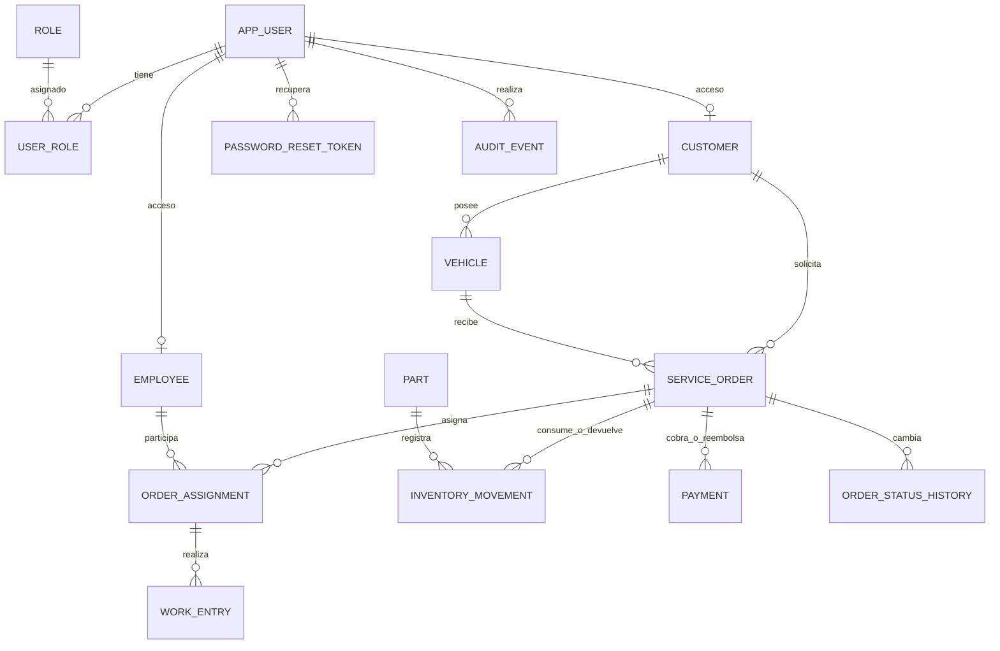

# Modelo inicial

Las claves foráneas impiden registros huérfanos. Ninguna relación borra el historial en cascada.

El backend deberá usar transacciones para cambiar estados junto con su historial, consumir piezas junto con el trabajo y registrar correcciones junto con la auditoría. Los permisos SQL son una segunda barrera; los permisos por cliente/empleado se aplicarán en Spring Security y servicios.

Reportes económicos: sumar trabajos no cancelados y movimientos CONSUMPTION/RETURN usando su cantidad firmada invertida, costo unitario y precio unitario históricos. Sumar pagos menos reembolsos por separado para evitar multiplicar importes mediante joins entre colecciones. La fecha de cierre define servicios terminados; la fecha del pago define cobros del período. No confundir ambos.

Pendiente antes del módulo financiero: definir impuestos, descuentos y política de costeo. Los importes de esta primera estructura son valores de línea; no se presenta como facturación fiscal.
