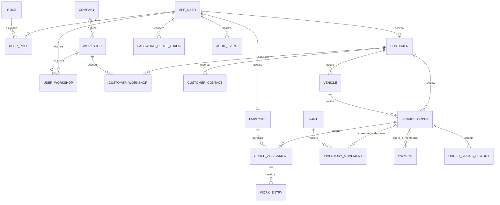

# Modelo de datos — vigente hasta V6

```mermaid
erDiagram
    APP_USER ||--o{ USER_ROLE : tiene
    ROLE ||--o{ USER_ROLE : asignado
    COMPANY ||--o{ WORKSHOP : agrupa
    APP_USER ||--o{ USER_WORKSHOP : alcance
    WORKSHOP ||--o{ USER_WORKSHOP : autoriza
    CUSTOMER ||--o{ CUSTOMER_WORKSHOP : asociado
    WORKSHOP ||--o{ CUSTOMER_WORKSHOP : atiende
    CUSTOMER ||--o{ CUSTOMER_CONTACT : reserva
    APP_USER ||--o| CUSTOMER : acceso
    APP_USER ||--o| EMPLOYEE : acceso
    APP_USER ||--o{ PASSWORD_RESET_TOKEN : recupera
    CUSTOMER ||--o{ VEHICLE : posee
    CUSTOMER ||--o{ SERVICE_ORDER : solicita
    VEHICLE ||--o{ SERVICE_ORDER : recibe
    SERVICE_ORDER ||--o{ ORDER_ASSIGNMENT : asigna
    EMPLOYEE ||--o{ ORDER_ASSIGNMENT : participa
    ORDER_ASSIGNMENT ||--o{ WORK_ENTRY : realiza
    SERVICE_ORDER ||--o{ INVENTORY_MOVEMENT : consume_o_devuelve
    PART ||--o{ INVENTORY_MOVEMENT : registra
    SERVICE_ORDER ||--o{ PAYMENT : cobra_o_reembolsa
    SERVICE_ORDER ||--o{ ORDER_STATUS_HISTORY : cambia
    APP_USER ||--o{ AUDIT_EVENT : realiza
```

Las claves foráneas impiden registros huérfanos. Ninguna relación borra el historial en cascada.

El backend usa transacciones para cambiar estados junto con su historial, consumir piezas junto con el trabajo y registrar correcciones junto con la auditoría. Los permisos SQL son una segunda barrera; los permisos por cliente/empleado se aplican en Spring Security y servicios.

Reportes económicos: sumar trabajos no cancelados y movimientos CONSUMPTION/RETURN usando su cantidad firmada invertida, costo unitario y precio unitario históricos. Sumar pagos menos reembolsos por separado para evitar multiplicar importes mediante joins entre colecciones. La fecha de cierre define servicios terminados; la fecha del pago define cobros del período. No confundir ambos.

Pendiente antes del módulo financiero: definir impuestos, descuentos y política de costeo. Los importes de esta primera estructura son valores de línea; no se presenta como facturación fiscal.

## Incremento de clientes y talleres

| Entidad / regla | Estado V6 |
|---|---|
| customer | Identidad separada, CURP/RFC, nacimiento, tres teléfonos y dirección; edad derivada. |
| workshop | Razón social, RFC, contacto, dirección completa, banner y versión. |
| customer_workshop | Relación N:M con estado propio; reasignación sin borrar historial. |
| user_workshop | Alcance explícito por taller para recepción, administrado por ADMIN. |
| customer_contact | Reserva global de emails/teléfonos; PK kind+value, FK customer; triggers. |
| Duplicados | CURP/RFC/celular, nombre+nacimiento, contactos cruzados y talleres únicos. |
| Migraciones | V1–V5 intactas; V6 probada sobre V5 existente y aplicada al entorno local. |
| Datos históricos | Se conservan; identidad/dirección desconocidas siguen NULL hasta completarse. |

[Contratos y permisos](administracion-clientes-talleres.md) · [Diagrama HTML](diagrams/data-model/data-model.html) · [SVG](diagrams/data-model/data-model.svg)
